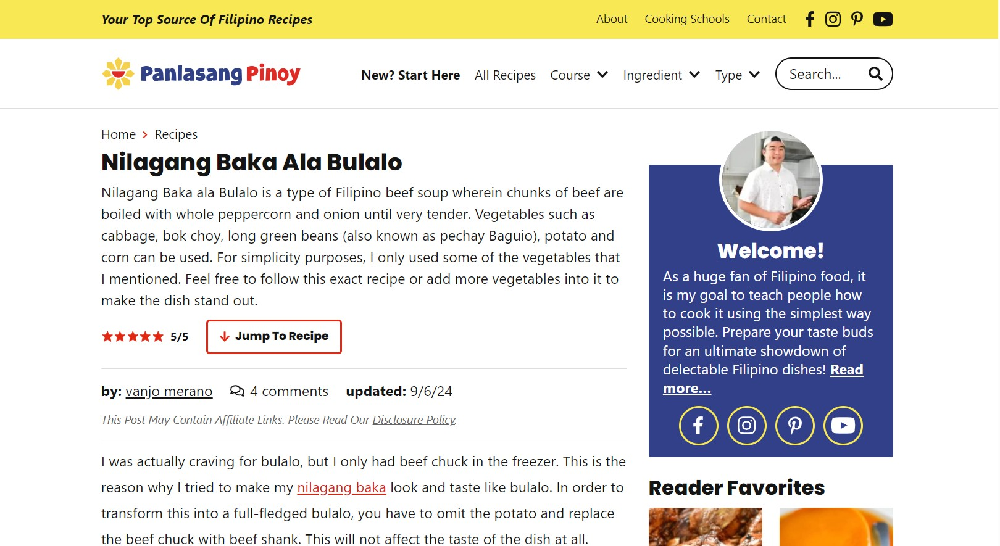
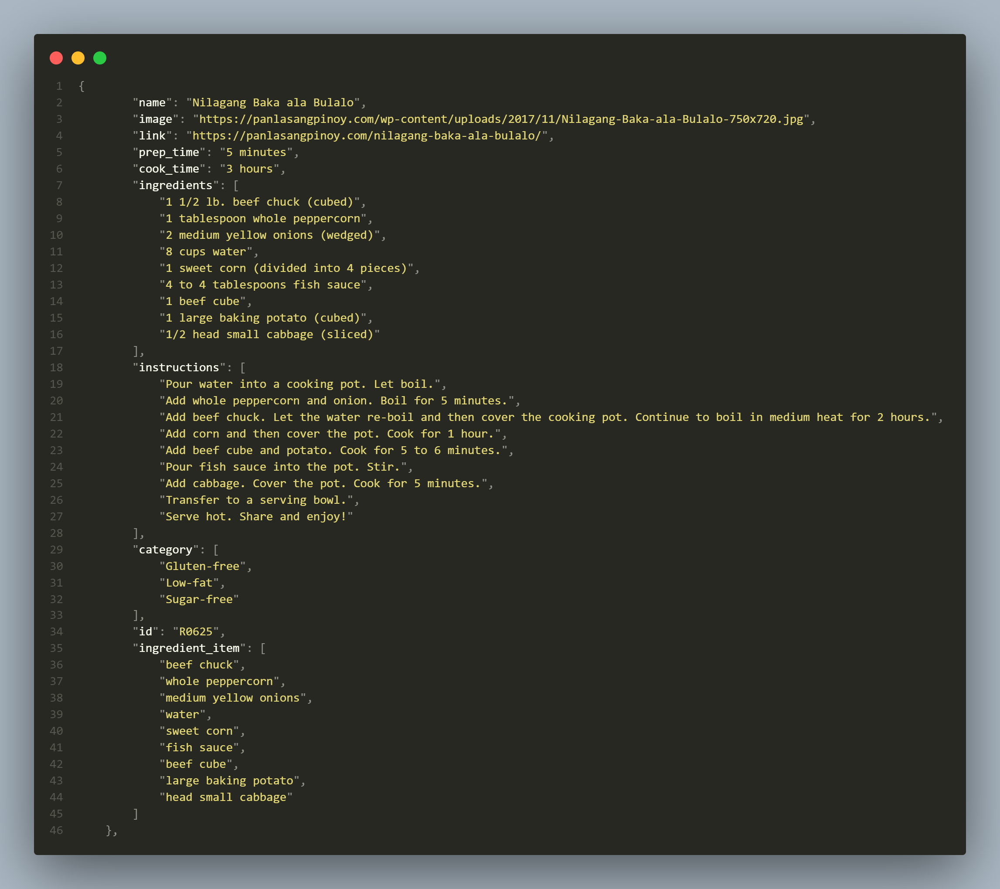

## Web Scraping Panlasang Pinoy Website using Python for initial version of Palayok Web App

### Description
This is a web scraping project that extracts recipes from the Panlasang Pinoy website. The extracted data is used for the initial version of the Palayok Web App, a course work for Application Development course. It provides a platform for users to search for Filipino recipes. The web scraping project is implemented using Python and the BeautifulSoup library.

### Process
1. Extract the links and images of recipes from the Panlasang Pinoy website recipe gallery using links-scrape.py
2. Extract the recipe name, ingredients, cooking time, prep time, and cooking instructions from each recipe link using recipe-scrape.py
3. Categorize the recipes into different dietary categories (e.g., vegetarian, vegan, gluten-free) based on the ingredients
4. Save the extracted data to json format for web app integration

The output of the two scripts is saved as scraped-links.json and scraped-recipes.json.
The cleaned-recipes.json is the result of final cleaning and filtering of scraped-recipes.json. It is the one used for the initial version of the Palayok Web App. Each recipe view in the web app links to the original recipe on the Panlasang Pinoy website.

